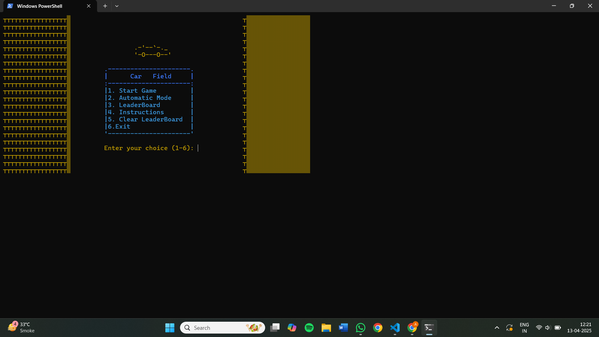
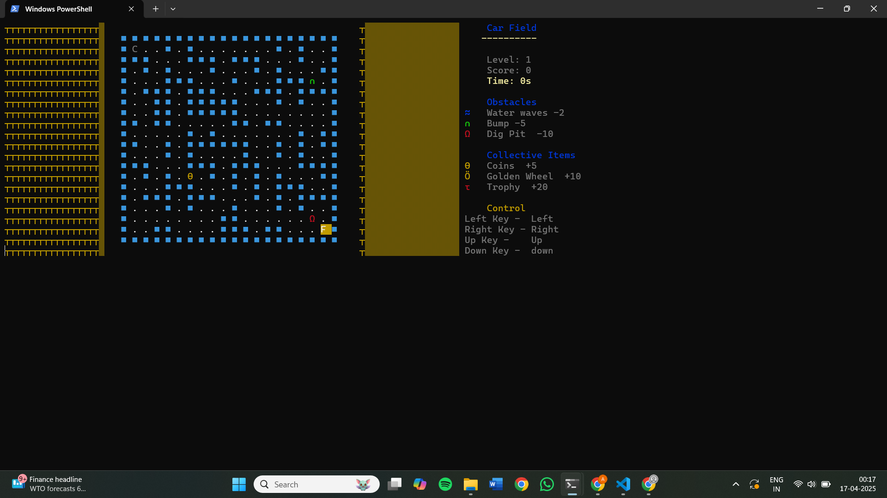
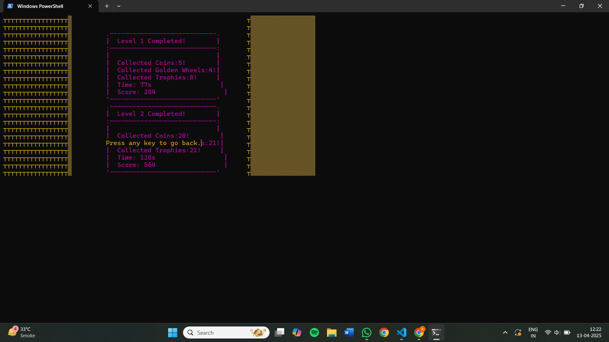
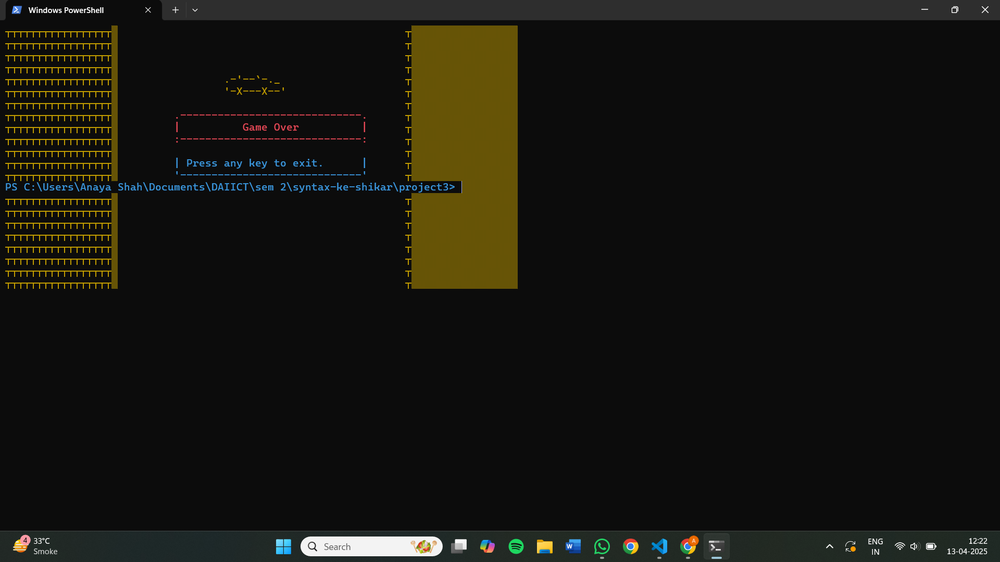

# Race Car Game – A Data Structures-Based Console Project

This repository contains a *C++ console-based Race Car Game, developed as part of a semester project for the **CS-2001 Data Structures course (Fall 2023)* at *FAST NUCES. This project offers a creative and interactive approach to learning and applying core data structures such as **graphs, **queues, **linked lists, **stacks, and **arrays* through the development of a real-time game.

## Table of Contents

- [Overview](#overview)
- [Features](#features)
- [How It Works](#how-it-works)
- [Data Structures in Action](#data-structures-in-action)
- [Installation & Execution](#installation--execution)
- [Game Controls](#game-controls)
- [Sample Output](#sample-output)
- [Functionalities (Detailed)](#functionalities-detailed)
- [Conceptual Q&A](#conceptual-qa)
- [GameH.h Customization](#gamehh-customization)
- [Contributors](#contributors)

## Overview

In this game, the player controls a race car that navigates through a dynamic maze while avoiding randomly appearing obstacles and collecting power-ups. The gameplay is powered by the use of *fundamental data structures*, each playing a key role in how game elements are generated, managed, and updated.

This project serves both as a *fun mini-game* and a *learning tool* for students to understand how abstract data structures can be applied to real-time systems like games.

## Features

- *Dynamic Maze Generation* using graph traversal algorithms.
- *Real-Time Obstacle Spawning* through a queue-based timed system.
- *Collectible Items* with random placements and scoring impact.
- *Leaderboard* maintained through sorted linked lists.
- *User Profiles* for storing player data and scores.
- *Pause & Resume Functionality* for session control.
- *Clean Console Graphics* using ASCII-based rendering.

## How It Works

- Maze is generated using graph traversal ensuring solvability.
- Player controls a car on the maze using keyboard input.
- Obstacles appear at intervals and move down the screen.
- Collectibles appear randomly and boost the player score.
- Scores and user profiles are stored for leaderboard tracking.

##  Data Structures in Action

| Data Structure | Usage |
|----------------|-------|
| *Graph* | Used to represent and generate the maze structure. |
| *Queue* | Manages the timed generation of obstacles. |
| *Linked List* | Stores player profiles and maintains a leaderboard. |
| *Stack* | (Optional) Can be used for undo or history of moves. |
| *Array* | Manages the game grid, placement of items, and boundary detection. |

## 🛠 Installation & Execution

### Prerequisites:
- C++ Compiler (e.g., g++, clang++)
- Terminal or command prompt

### Steps:
```bash
git clone https://github.com/syntax-ke-shikar/Data-Structures-Game-Project.git
cd Data-Structures-Game-Project
g++ Source.cpp -o RaceCarGame
./RaceCarGame
```


## Game Controls

- ← / →: Move the car left or right
- P: Pause the game
- Q: Quit the game
- Enter: Start or resume gameplay


## Scoring System

The game uses a point-based scoring system where the player can earn or lose points by interacting with obstacles and collecting items. Below is a breakdown of how the scoring system works:

#### Obstacles
- **Obstacle Types**: There are three types of obstacles, and they have different negative impacts on the score.
    - **Type 1** (every third obstacle): -2 points.
    - **Type 2** (every second obstacle): -5 points.
    - **Type 3** (remaining obstacles): -10 points.
  
- **Colliding with Obstacles**: If the player's car collides with an obstacle, the score will decrease based on the obstacle's type. The collision causes a penalty to the score, and the game will alert the player with a beep sound. The penalty can be one of:
    - **-2 points** for Type 1 obstacles.
    - **-5 points** for Type 2 obstacles.
    - **-10 points** for Type 3 obstacles.

- **Game Over Condition**: If the score goes below 0, the game ends, and a "Game Over" screen will appear.

#### Collected Items
- **Item Types**: There are three types of collectable items that the player can gather, each offering different points:
    - **Coin**: 5 points (represented by a specific symbol).
    - **Golden Wheel**: 10 points (represented by another symbol).
    - **Trophy**: 20 points (represented by a different symbol).
  
- **Item Impact**: When the player collects any of these items, the corresponding points are added to the score.

#### Score Update Logic
1. **Initialization**: Both obstacles and collected items are randomly placed on the grid at the start of each level, with their locations depending on the level number.
2. **Scoring**: The score is updated dynamically during the game. Every time the car collides with an obstacle, the penalty is applied. Similarly, collecting an item will increase the score by the item's value.
3. **Level Influence**: As the player progresses through levels, the number of obstacles and items increases, and the grid is filled with more challenges.


## Sample Output








## Functionalities (Detailed)

- *Maze Generation*: DFS/BFS used to carve a valid path.
- *Obstacle Management*: Queue ensures timed appearance and removal.
- *Collectibles*: Random placement tracked by arrays.
- *Score Tracking*: Score increases based on collectibles and time.
- *Leaderboard*: Maintains and updates sorted player scores.
- *Profile Handling*: Save/load functionality via linked lists.

## Use of customised GameH.h header file

### Purpose
GameH.h is a custom console graphics header that provides:
- gotoxy(): Precise cursor placement
- setColor(): Color-coded elements
- clearScreen(): Clears console efficiently
- kbhit() and getch(): Real-time key detection

### Integration
It is included via:
cpp
#include "GameH.h"

Used for:
- Drawing the car and obstacles
- Taking input without blocking
- Changing display color
- Cursor positioning on maze grid

### Note
This uses Windows-specific headers (conio.h, windows.h). Cross-platform compatibility would require alternatives like ncurses.

## Contributors

- Sharvil Shah
- Anaya Shah
- Yashvi Doshi
- Yash Judal
- GitHub: [@syntax-ke-shikar](https://github.com/syntax-ke-shikar)

## What Did We Learn?

This project provided practical insights into the real-world application of data structures, especially in interactive systems like games. Here’s a breakdown of key learning outcomes:

- *Graph Theory in Maze Design*: Understood how graphs can represent grids and how traversal algorithms like DFS and BFS help in generating solvable paths.
- *Queue for Timing Mechanisms*: Realized the effectiveness of queues in simulating real-time systems such as spawning moving obstacles.
- *Linked List for Dynamic Leaderboards*: Gained experience with sorted linked lists to maintain a flexible and dynamic high score system.
- *Console Programming*: Learned to manipulate console output, cursor control, and real-time input using low-level programming techniques.
- *Data Management*: Implemented user profiles and persistent score tracking.
- *File Handling* : For implementing the leaderboard logic.
- *Modular Programming*: Experienced the benefits of separating game logic and utilities into header files like GameH.h.

---

## Dijkstra's Algorithm in Maze Navigation

Though not used for maze generation, *Dijkstra's algorithm* can be applied to calculate the shortest path from the player's start point to the goal in the maze. Here's how it works conceptually:

#### Working of Dijkstra's Algorithm:

1. *Initialization*:
   - Mark all nodes (cells) as unvisited.
   - Set the distance to the starting node as 0, and all others as ∞.

2. *Set the Current Node*:
   - Begin with the node that has the smallest tentative distance (starting point initially).

3. *Explore Neighbors*:
   - For each neighbor of the current node, calculate the tentative distance from the start node.
   - If the new calculated distance is smaller, update it.

4. *Mark Visited*:
   - Once all neighbors are considered, mark the current node as visited. Visited nodes are never checked again.

5. *Repeat*:
   - Continue with the unvisited node that has the smallest tentative distance.
   - Repeat until all nodes are visited or the destination node’s shortest distance is finalized.

#### Application in the Game:

In a more advanced version of this game:
- You can use Dijkstra’s algorithm to show a "hint path" to the player.
- Or implement AI that follows the shortest path avoiding obstacles.
- Also helps to measure how far a collectible or finish line is from the player in terms of steps.

Dijkstra’s algorithm is key in understanding weighted graphs and shortest path algorithms used in navigation systems, games, and network routing.

## FAQ

*Q1. What algorithm is used to generate the maze?*  
*A:* A depth-first traversal ensures every cell is reachable. The graph structure allows creation of paths while maintaining walls between unvisited nodes.

*Q2. Why use a queue for obstacles?*  
*A:* Queues provide first-in-first-out (FIFO) behavior, perfect for timed obstacle generation. The oldest obstacles get removed as new ones appear.

*Q3. How are collectible placements ensured to be fair?*  
*A:* The grid is scanned for free cells using an array. Random coordinates are chosen and validated before placing a collectible.

*Q4. How are players' scores stored?*  
*A:* A singly linked list stores player names and scores. The list is sorted each time a new score is added for leaderboard display.

*Q5. Could stacks be added to enhance gameplay?*  
*A:* Yes! A stack can be used for undoing moves or for tracking history in a puzzle mode variant.

*Q6. How is collision detected?*  
*A:* The grid array is checked at the player's current position. If an obstacle or wall exists at that cell, a collision is triggered.

##  Known Bugs & Issues

While the game is functional and interactive, the following bugs and areas for improvement have been identified:

1. **Multiplayer Mode Crash**:
   - The game sometimes **abruptly ends** during multiplayer sessions.
   - Likely due to race conditions or index out-of-bounds in player update loops.

2. **Maze Display Refresh Inefficiency**:
   - Every call to `displayMaze()` **clears the screen**, even for small updates.
   - This leads to flickering and unnecessary redraws.

3. **Leaderboard Misalignment**:
   - The output of the **leaderboard is not properly aligned**.
   - Player names and scores do not appear in clean columns.

4. **Platform Dependency**:
   - Uses Windows-specific headers like `<conio.h>` and `<windows.h>`, so it won't work on Linux or macOS without porting.

5. **No Input Validation**:
   - Inconsistent handling of invalid inputs in the main menu or name entry can cause erratic behavior.

###  Planned Fixes:
- Optimize the `displayMaze()` function to use **partial redraws** or **double buffering**.
- Refactor multiplayer logic for better state management.
- Align leaderboard output using `setw()` or formatted I/O.
- Abstract platform-dependent code to improve portability.

---
